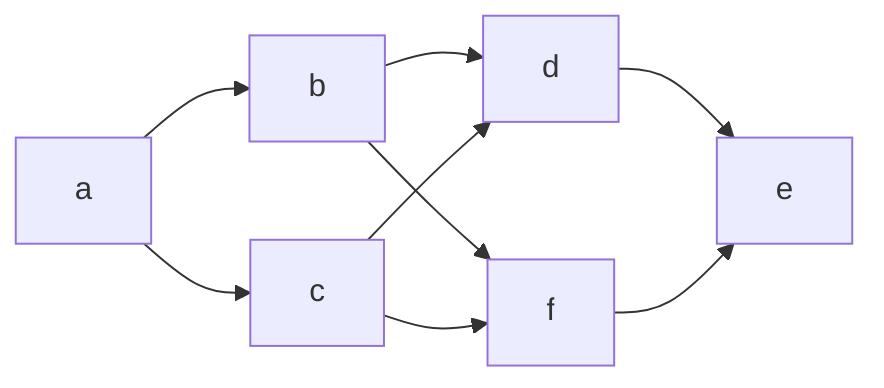

# magio

magio是一个基于事件循环和线程池的协程库

## Hello world

```cpp
Coro<string> task1() {
    co_return "hello ";
}

Coro<string> task2() {
    co_return "world";
}

Coro<> do_tasks() {
    co_await timeout(3000);
    auto [s1, s2] = co_await (task1() && task2());
    cout << s1 << s2 << endl;
}

int main() {
    EventLoop loop;
    co_spawn(loop.get_executor(), do_tasks(), detached);
    loop.run();
}
```

```shell
hello world
```

## Coro

```cpp
Coro<int> factorial(std::string_view name, int num) {
    int res = 1;
    Timer timer(co_await this_coro::executor, 1000);

    for (int i = 2; i <= num; ++i) {
        printf("Task %s: Compute factorial %d, now i = %d\n", name.data(), num, i);
        co_await timer.async_wait(use_coro);
        res *= i;
    }
    printf("Task %s: factorial %d = %d\n", name.data(), num, res);
    co_return res;
}

int main() {
    EventLoop loop;
    co_spawn(
        loop.get_executor(), 
        []() -> Coro<void> {
            auto [a, b, c] = co_await coro_join(
                factorial("A", 2),
                factorial("B", 3),
                factorial("C", 4)
            );
            assert(a == 2);
            assert(b == 6);
            assert(c = 24);
        }(),
        detached
    );
    loop.run();
}
```

output

```shell
Task A: Compute factorial 2, now i = 2
Task B: Compute factorial 3, now i = 2
Task C: Compute factorial 4, now i = 2
Task A: factorial 2 = 2
Task B: Compute factorial 3, now i = 3
Task C: Compute factorial 4, now i = 3
Task B: factorial 3 = 6
Task C: Compute factorial 4, now i = 4
Task C: factorial 4 = 24
```

## Channel

```cpp
void func1(shared_ptr<Channel<int, string>> chan) {
    for (size_t i = 0; i < 5; ++i) {
        chan->async_receive([](int n, string str) {
            printf("%s receive %d %s\n", "func1", n, str.c_str());
        });
    }
}

Coro<void> func2(shared_ptr<Channel<int, string>> chan) {
    for (size_t i = 0; i < 5; ++i) {    
        auto [n, str] = co_await chan->async_receive(use_coro);
        printf("%s receive %d %s\n", "func2", n, str.c_str());
    }
}

int main() {
    ThreadPool pool(8);

    auto channel = make_shared<Channel<int, string>>(pool.get_executor());
    for (size_t i = 0; i < 10; ++i) {
        channel->async_send(i, "from main");
    }
    pool.post([=] { func1(channel); });
    co_spawn(pool.get_executor(), func2(channel), detached);
    
    pool.join();
}
```

output

```shell
func1 receive 0 from main
func1 receive 1 from main
func1 receive 2 from main
func1 receive 3 from main
func1 receive 4 from main
func2 receive 5 from main
func2 receive 6 from main
func2 receive 7 from main
func2 receive 8 from main
func2 receive 9 from main
```

## Workflow



```cpp
int main() {
    ThreadPool pool(8);
    
    auto a = Workflow::create_task([](ContextPtr ctx) {
        printf("task a start!\n");
    });
    auto b = Workflow::create_timed_task(5000, [](ContextPtr ctx) {
        printf("task b timeout!\n");
    });
    auto c = Workflow::create_timed_task(1000, [](ContextPtr ctx) {
        printf("task c timeout!\n");
    });
    auto d = Workflow::create_task([](ContextPtr ctx) {
        printf("task d start!\n");
    });
    auto e = Workflow::create_timed_task(2000, [](ContextPtr ctx) {
        printf("task e timeout!\n");
    });
    auto f = Workflow::create_task([](ContextPtr ctx) {
        cout << "task f start!\n";
    });

    a->successor(b, c);
    b->successor(d, e);
    c->successor(d, e);
    d->successor(f);
    e->successor(f);

    Workflow::run(pool.get_executor(), a, [](exception_ptr eptr) {
        if (eptr) {
            try {
                rethrow_exception(eptr);
            } catch(const exception& e) {
                cout << e.what() << '\n';
            }
        }
    });
}
```

output

```shell
task a start!
task c timeout!
task b timeout!
task d start!
task e timeout!
task f start!
```

## Tcp echo

### Client

```cpp
Coro<void> amain() {
    try {
        auto client = co_await TcpClient::create();
        auto stream = co_await client.connect("127.0.0.1", 8000);

        cout << stream.remote_address().to_string()
             << " connect "
             << stream.local_address().to_string()
             << '\n';

        for (int i = 0; i < 5; ++i) {
            auto [wlen, str] = co_await (
                stream.write("Hello server..", 14) | 
                stream.read()
            );
            cout << str << '\n';
        }
    } catch(const std::exception& err) {
        cout <<  err.what() << '\n';
    }
}

int main() {
    EventLoop loop;
    co_spawn(loop.get_executor(), amain(), detached);
    loop.run();
}
```

output

```shell
127.0.0.1:8080 connect 127.0.0.1:1234
Hello client..
Hello client..
Hello client..
Hello client..
Hello client..
```

### Server

```cpp
Coro<void> process(TcpStream stream) {
    try {
        for (; ;) {
            auto [str, wlen] = co_await (
                stream.read() | 
                stream.write("hello client", 12)
            );
            cout << str << '\n';
        }
    } catch(const std::runtime_error& err) {
        cout << err.what() << '\n';
    }
}

Coro<void> amain() {
    try {
        auto server = co_await TcpServer::bind("127.0.0.1", 8000);
        for (; ;) {
            auto stream = co_await server.accept();

            cout << stream.remote_address().to_string() 
                 << " connect "
                 << stream.local_address().to_string()
                 << '\n';
        
            co_spawn(co_await this_coro::executor, process(std::move(stream)), detached);
        }
    } catch(const std::runtime_error& err) {
        cout << err.what() << '\n';
    }
}

int main() {
    EventLoop loop;
    co_spawn(loop.get_executor(), amain(), detached);
    loop.run();
}
```

output

```shell
127.0.0.1:1234 connect 127.0.0.1:8080
Hello server..
Hello server..
Hello server..
Hello server..
Hello server..
Client disconnected
```

## Benchmark

Using the Apache Benchmarking tool, 1000000 requests, 1000 concurrency, enable keepalive, the QPS/RPS result below:

| framework      |  RPS [#/sec] (mean) | Language |   Pattern |
|----------------|--------------------:| --------: |----------:|
| [C++ asio](docs/benchmark.md#cpp-asio)        | 42389.54  | C++           | coroutine |
| [C++ libuv](docs/benchmark.md#cpp-libuv)      | 43397.97  | C++           | coroutine |
| [C++ magio](docs/benchmark.md#cpp-magio)      | 43068.93  | C++           | coroutine |
| [Rust tokio](docs/benchmark.md#rust-tokio)    | 46215.20  | Rust          | coroutine |
| [NodeJs](docs/benchmark.md#nodejs)            | 39292.92  | JavaScript    | eventloop |

More detail see: [benchmark.md](docs/benchmark.md)
